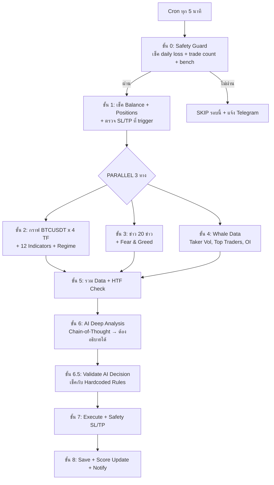

# ClawBot AI — Implementation Plan v6 (OpenClaw-Inspired)

> **Single-Coin Focus + AI Reasoning Engine + Champion Risk Rules**
> Code = เครื่องมือดึงข้อมูล | **AI = สมองตัดสินใจเทรด (ต้องอธิบายเหตุผลได้)**
> VPS: 8GB RAM, 2 Core | Cron ทุก 5 นาที | เสร็จ <30 วินาที

---

## สิ่งที่เปลี่ยนจาก v5

| หัวข้อ | v5 (เก่า) | v6 (ใหม่) | เหตุผล |
|--------|----------|----------|--------|
| **เหรียญ** | 8 เหรียญ + dynamic | **1 เหรียญ (BTCUSDT)** | focus = แม่นยำกว่า, AI วิเคราะห์ลึกกว่า |
| **Risk Rules** | AI ตัดสินใจเอง ไม่มี daily limit | **Hardcoded rules ที่ AI bypass ไม่ได้** | ตาม Alpha Arena winners |
| **Strategy Scoring** | ไม่มี | **มี score + decay + bench** | self-evaluation loop |
| **Daily Loss Limit** | ไม่มี | **-5% หยุดเทรดทั้งวัน** | ป้องกันหายนะ |
| **Position Size** | dynamic ตาม balance tier | **Max 2% ของ equity (hardcoded)** | 1-2% Rule จาก Alpha Arena |
| **AI Decision** | วิเคราะห์ผิวเผิน 8 เหรียญ | **Deep analysis 1 เหรียญ + chain-of-thought** | reasoning ที่อธิบายได้ |
| **HTF Alignment** | optional | **บังคับ — ห้ามเทรดสวน higher TF** | "Don't Catch Knives" |
| **Consecutive Losses** | ไม่มีการจัดการ | **แพ้ 3 ครั้งติด → bench (พัก 1 ชม.)** | strategy decay |
| **Max Trades/Day** | ไม่จำกัด | **20 เทรด/วัน** | ป้องกัน overtrading |

---

## ปรัชญาหลัก (จาก OpenClaw + Alpha Arena)

```
"You are the CIO, AI is your Lead Trader"
— AI ต้องอธิบายเหตุผลทุกเทรด
— ถ้าอธิบายไม่ได้ → ไม่เทรด
— Hardcoded risk rules ที่ AI ไม่สามารถ bypass ได้
— ทุกเทรดต้อง align กับ higher timeframe
— บันทึก expected vs actual → เรียนรู้จากตัวเอง
```

---

## Single-Coin Focus: ทำไมแค่ BTC?

```
ปัญหาของ 8 เหรียญ:
- AI ต้องวิเคราะห์ 8 x 4 TF = 32 ชุด indicators → ผิวเผิน
- Token limit: ข้อมูลเยอะ → AI ตัดสินใจแย่ลง
- Noise: เหรียญ altcoin ถูก BTC ลากอยู่แล้ว ~70-80%

ข้อดีของ 1 เหรียญ (BTC):
- AI วิเคราะห์ลึก 4 TF + whale + news + sentiment → แม่นยำขึ้น
- Token ที่ส่ง AI น้อยลง → response ดีขึ้น ถูกลง
- Liquidity สูงสุด → slippage น้อยที่สุด
- ข่าว BTC = ข่าวตลาดทั้งหมด
- Focus = ความแม่นยำ → Win Rate สูงขึ้น

อนาคต: ถ้า BTC profitable → เพิ่ม ETH เป็นเหรียญที่ 2
```

---

## Workflow (8 ขั้นตอน)



---

## ขั้น 0: Safety Guard (NEW — ก่อนทำอะไรทั้งหมด)

**Hardcoded Rules ที่ AI ไม่สามารถ bypass ได้:**

```python
HARDCODED_RULES = {
    # Position Sizing (จาก Alpha Arena "1-2% Rule")
    "MAX_POSITION_SIZE_PCT": 0.02,      # ไม่เกิน 2% ของ equity ต่อเทรด
    "MAX_TOTAL_EXPOSURE_PCT": 0.10,     # exposure รวมไม่เกิน 10%

    # Stop Loss
    "MANDATORY_STOP_LOSS": True,        # ทุกเทรดต้องมี SL
    "MAX_STOP_LOSS_PCT": 0.05,          # SL ไม่เกิน 5% จาก entry

    # Daily Limits
    "MAX_DAILY_LOSS_PCT": 0.05,         # ขาดทุน > 5% ต่อวัน → หยุดเทรดทั้งวัน
    "MAX_TRADES_PER_DAY": 20,           # ไม่เกิน 20 เทรด/วัน

    # Trend Filter (จาก "Don't Catch Knives")
    "REQUIRE_HTF_ALIGNMENT": True,      # ต้อง align กับ 1h/4h trend

    # Strategy Benching (จาก Alpha Arena)
    "BENCH_AFTER_CONSECUTIVE_LOSSES": 3, # แพ้ 3 ครั้งติด → พัก 1 ชม.
    "STRATEGY_SCORE_DECAY_PER_HOUR": 1,  # score ลดทุกชั่วโมง

    # Explainability
    "REQUIRE_EXPLANATION": True,         # AI ต้องให้เหตุผลทุกเทรด
}
```

**Guard Logic:**
```python
async def safety_guard(state):
    """เช็คก่อนทำอะไร — ถ้าไม่ผ่าน → SKIP รอบนี้"""

    # 1. เช็ค daily loss
    if state["daily_pnl_pct"] <= -HARDCODED_RULES["MAX_DAILY_LOSS_PCT"]:
        return {"allow": False, "reason": "Daily loss limit reached (-5%)"}

    # 2. เช็ค trade count
    if state["trades_today"] >= HARDCODED_RULES["MAX_TRADES_PER_DAY"]:
        return {"allow": False, "reason": "Max 20 trades/day reached"}

    # 3. เช็ค bench status
    if state["bench_until"] and datetime.now() < state["bench_until"]:
        return {"allow": False, "reason": f"Benched until {state['bench_until']}"}

    return {"allow": True}
```

---

## ขั้น 1: เช็คสถานะ

เหมือน v5 แต่เพิ่ม:
- ดึง **daily PnL** สะสม (สำหรับ daily loss limit check)
- ดึง **consecutive losses count** (สำหรับ bench check)
- ดึง **trade count วันนี้** (สำหรับ max trades check)
- ดึง **strategy score ปัจจุบัน**

**Return Format:**
```python
{
    "data_type": "account",
    "fetched_at": "2026-02-14T01:00:01Z",
    "balance_usdt": 150.42,
    "available_margin": 120.00,
    "equity": 155.00,  # balance + unrealized PnL

    # Safety state
    "daily_pnl_usdt": -3.20,
    "daily_pnl_pct": -2.1,
    "trades_today": 5,
    "consecutive_losses": 1,
    "strategy_score": 72,      # 0-100, เริ่ม 50
    "bench_until": null,

    "positions": [
        {
            "symbol": "BTCUSDT",
            "side": "LONG",
            "binance_order_id": "12345678",
            "entry_price": 97500,
            "current_price": 98200,
            "quantity": 0.002,
            "margin_usdt": 3.10,   # max 2% of equity
            "leverage": 20,
            "unrealized_pnl": 1.44,
            "unrealized_pnl_pct": 14.4,
            "hold_duration_min": 35,
            "safety_sl_price": 95000,
            "safety_tp_price": 101000
        }
    ],
    "closed_since_last_cycle": [
        {
            "symbol": "BTCUSDT",
            "side": "SHORT",
            "closed_by": "STOP_LOSS",
            "realized_pnl": -2.10,
            "commission": 0.08,
            "expected_outcome": "profit +3%",
            "actual_outcome": "loss -2.1%",
            "note": "SL triggered ระหว่างรอบ"
        }
    ]
}
```

---

## ขั้น 2: กราฟ BTCUSDT x 4 TF (Deep Analysis)

**เหรียญเดียว = วิเคราะห์ลึกกว่า:**

| TF | แท่ง | ครอบคลุม | หน้าที่ |
|----|------|----------|--------|
| **5m** | 200 | ~16 ชม. | **Primary** — entry/exit signals |
| **15m** | 100 | ~25 ชม. | Trend กลาง + confirmation |
| **1h** | 48 | 2 วัน | Major trend + HTF alignment check |
| **4h** | 24 | 4 วัน | **Macro** — directional bias (บังคับ align) |

**12 Indicators (เหมือน v5):**

| # | Indicator | ใช้ทำอะไร |
|---|-----------|----------|
| 1 | **EMA 9/21/55** | Trend + crossover |
| 2 | **RSI 14** | Overbought/Oversold |
| 3 | **MACD (12,26,9)** | Momentum |
| 4 | **Bollinger Bands (20,2)** | Volatility |
| 5 | **ATR 14** | Dynamic SL/TP |
| 6 | **VWAP** | Institutional level |
| 7 | **ADX 14** | Trend strength |
| 8 | **Stochastic RSI** | Fast reversal |
| 9 | **OBV** | Volume divergence |
| 10 | **Supertrend (10,3)** | Trend direction |
| 11 | **Volume Ratio** | Volume anomaly |
| 12 | **EMA 200 (1h)** | Major trend filter |

**HTF Alignment Check (บังคับ):**
```python
def check_htf_alignment(indicators):
    """ต้อง align กับ 1h และ 4h ก่อนเทรด"""
    htf_bullish = (
        indicators["1h"]["supertrend"]["direction"] == "up" and
        indicators["4h"]["supertrend"]["direction"] == "up" and
        indicators["1h"]["ema9"] > indicators["1h"]["ema21"]
    )
    htf_bearish = (
        indicators["1h"]["supertrend"]["direction"] == "down" and
        indicators["4h"]["supertrend"]["direction"] == "down" and
        indicators["1h"]["ema9"] < indicators["1h"]["ema21"]
    )
    return {
        "can_long": htf_bullish,
        "can_short": htf_bearish,
        "direction": "bullish" if htf_bullish else "bearish" if htf_bearish else "neutral"
    }
```

**Return Format:**
```python
{
    "data_type": "market_data",
    "fetched_at": "2026-02-14T01:00:00Z",
    "symbol": "BTCUSDT",
    "price": 98200,

    "indicators_5m": { /* 12 indicators เต็ม */ },
    "indicators_15m": { /* 12 indicators เต็ม */ },
    "indicators_1h": { /* 12 indicators เต็ม + EMA200 */ },
    "indicators_4h": { /* key indicators: EMA, RSI, Supertrend, ADX */ },

    "regime": "trending_up",

    # HTF Alignment (บังคับเช็ค)
    "htf_alignment": {
        "can_long": true,
        "can_short": false,
        "direction": "bullish",
        "reason": "1h+4h Supertrend UP, EMA9>EMA21 ทั้ง 2 TF"
    },

    # Market data
    "funding_rate": 0.0001,
    "long_short_ratio": 1.25,
    "volume_24h_usdt": 1500000000,
    "price_change_5m_pct": 0.15,
    "price_change_1h_pct": 0.8,
    "price_change_24h_pct": 2.3,

    # Whale Activity
    "whale_activity": {
        "taker_buy_sell_ratio": 1.35,
        "top_trader_long_pct": 62.5,
        "top_trader_short_pct": 37.5,
        "open_interest_usdt": 5200000000,
        "order_book_bid_ask_ratio": 1.8,
        "whale_walls": ["bid wall at 97500", "ask wall at 99000"]
    }
}
```

---

## ขั้น 3: ข่าว + Sentiment (เหมือน v5)

- ดึง **20 ข่าวล่าสุด** (CryptoPanic + RSS + Stealth)
- **Focus BTC news** — filter เฉพาะข่าวที่เกี่ยวกับ BTC หรือตลาดรวม
- Fear & Greed Index

---

## ขั้น 4: Whale Data (เหมือน v5)

- Taker Buy/Sell Ratio
- Top Trader Long/Short
- Order Book Depth / Whale Walls
- Open Interest

---

## ขั้น 5: รวม Data + HTF Check

เหมือน v5 แต่:
- **เช็ค HTF Alignment ก่อนส่ง AI** — ถ้า neutral (ไม่มี direction) → บอก AI ว่า "ห้ามเปิด position ใหม่"
- ใส่ **strategy score** และ **consecutive losses** ใน context ให้ AI

---

## ขั้น 6: AI Deep Analysis (CORE CHANGE)

### AI Prompt ใหม่ (Chain-of-Thought + Explainable)

```
SYSTEM PROMPT:
You are an expert BTC futures trader AI. You MUST follow these rules:

HARDCODED RULES (cannot override):
1. Max position: 2% of equity
2. Every trade MUST have stop-loss (max -5% from entry)
3. LONG only when HTF alignment = bullish
4. SHORT only when HTF alignment = bearish
5. If HTF = neutral → HOLD or SKIP only
6. Every decision MUST have clear reasoning (chain-of-thought)
7. If you cannot explain WHY → action = SKIP

ANALYSIS FRAMEWORK (Think step by step):
Step 1: Read HTF direction (4h + 1h) — what is the macro trend?
Step 2: Read 15m trend — does it confirm or diverge from HTF?
Step 3: Read 5m signals — is there a clear entry/exit signal NOW?
Step 4: Check whale data — are big players buying or selling?
Step 5: Check news + sentiment — any catalysts or risks?
Step 6: Check current positions — manage existing before opening new
Step 7: Risk assessment — calculate exact margin, SL, TP based on ATR
Step 8: Final decision with confidence score (0-100)

CONFIDENCE THRESHOLD:
- confidence >= 75 → execute trade
- confidence 50-74 → HOLD/monitor only
- confidence < 50 → SKIP (do nothing)

POSITION MANAGEMENT:
- Profitable position > +10%: evaluate momentum, close if weakening
- Losing position > -3%: cut if trend reversed, hold if still aligned
- AI สามารถตั้ง SL/TP ที่เหมาะสมตาม technical levels (support/resistance)

OUTPUT FORMAT (must be valid JSON):
{
    "chain_of_thought": {
        "step1_htf": "4h Supertrend UP, EMA9>21. 1h also UP. Macro = BULLISH",
        "step2_15m": "15m trend confirming uptrend, MACD histogram positive",
        "step3_5m": "5m RSI bounced from 35, EMA9 crossing above EMA21",
        "step4_whales": "Taker ratio 1.35 = buyers dominating, OI rising",
        "step5_news": "BTC ETF inflow news = bullish catalyst",
        "step6_positions": "No open positions currently",
        "step7_risk": "ATR=$350, SL at recent swing low $97,500, TP at resistance $99,800",
        "step8_decision": "All signals aligned → OPEN_LONG with high confidence"
    },
    "confidence": 82,
    "action": {
        "symbol": "BTCUSDT",
        "action": "OPEN_LONG",
        "margin_usdt": 3.10,
        "sl_price": 97500,
        "tp_price": 99800,
        "reason": "HTF bullish + 5m EMA cross + whale buying + ETF inflow news"
    },
    "expected_outcome": "+2.3% within 2-6 cycles based on momentum",
    "market_view": "BTC bullish short-term, supported by institutional inflows"
}
```

### AI Response Validation (ขั้น 6.5)

**หลัง AI ตอบ → validate ก่อน execute:**

```python
async def validate_ai_decision(ai_response, account, htf_alignment):
    """Validate AI decision กับ hardcoded rules"""
    action = ai_response["action"]
    errors = []

    # 1. Confidence check
    if ai_response["confidence"] < 75 and action["action"] in ["OPEN_LONG", "OPEN_SHORT"]:
        errors.append(f"Confidence {ai_response['confidence']} < 75, cannot open")

    # 2. HTF alignment check
    if action["action"] == "OPEN_LONG" and not htf_alignment["can_long"]:
        errors.append("Cannot LONG: HTF not bullish")
    if action["action"] == "OPEN_SHORT" and not htf_alignment["can_short"]:
        errors.append("Cannot SHORT: HTF not bearish")

    # 3. Position size check (max 2%)
    max_margin = account["equity"] * HARDCODED_RULES["MAX_POSITION_SIZE_PCT"]
    if action.get("margin_usdt", 0) > max_margin:
        action["margin_usdt"] = max_margin  # force cap

    # 4. SL check
    if action["action"] in ["OPEN_LONG", "OPEN_SHORT"]:
        if not action.get("sl_price"):
            errors.append("No SL price — mandatory")
        else:
            sl_pct = abs(action["sl_price"] - account["positions"][0]["entry_price"] if account["positions"] else 98200) / 98200
            if sl_pct > HARDCODED_RULES["MAX_STOP_LOSS_PCT"]:
                errors.append(f"SL {sl_pct:.1%} > max 5%")

    # 5. Explanation check
    if not ai_response.get("chain_of_thought"):
        errors.append("No chain-of-thought reasoning")

    if errors:
        return {"valid": False, "errors": errors, "override_action": "SKIP"}

    return {"valid": True, "action": action}
```

---

## ขั้น 7: Execute (เหมือน v5 + validation)

เหมือน v5 แต่:
- **ผ่าน validation ก่อน** (ขั้น 6.5)
- ถ้า validation fail → SKIP + log เหตุผล
- Position size ถูก cap ที่ 2% equity เสมอ

---

## ขั้น 8: Save + Strategy Score Update (NEW)

### Strategy Score System (จาก Alpha Arena)

```python
async def update_strategy_score(trade_result, current_score):
    """Update score หลังทุกเทรด"""

    if trade_result["realized_pnl"] > 0:
        # ชนะ: +5 score (cap at 100)
        new_score = min(100, current_score + 5)
    else:
        # แพ้: -10 score (min 0)
        new_score = max(0, current_score - 10)

    # Decay: -1 per hour (ทำใน cron แยก)

    return new_score
```

### Self-Evaluation Loop (จาก Alpha Arena)

```python
async def self_evaluate(trade):
    """เทียบ expected vs actual — เรียนรู้จากตัวเอง"""
    evaluation = {
        "trade_id": trade["id"],
        "expected": trade["expected_outcome"],    # AI ทำนายไว้ตอนเปิด
        "actual": f"{trade['realized_pnl_pct']:.1f}%",
        "correct_direction": trade["realized_pnl"] > 0,
        "lesson": ""  # AI จะ fill ในรอบถัดไป
    }

    # บันทึกลง Supabase → AI จะเห็นในรอบถัดไป
    await save_evaluation(evaluation)
```

### Consecutive Loss → Bench

```python
async def check_bench(consecutive_losses):
    """แพ้ 3 ครั้งติด → bench 1 ชั่วโมง"""
    if consecutive_losses >= HARDCODED_RULES["BENCH_AFTER_CONSECUTIVE_LOSSES"]:
        bench_until = datetime.now() + timedelta(hours=1)
        await notify(f"BENCHED: 3 consecutive losses. Resume at {bench_until}")
        return bench_until
    return None
```

---

## Risk Management (Champion Rules)

### Hardcoded Rules Summary

| Rule | ค่า | ที่มา | ทำไม |
|------|-----|------|------|
| **Max Position** | 2% of equity | Alpha Arena "1-2% Rule" | LLM hallucinate → ไม่เจ๊บ |
| **Max Exposure** | 10% of equity | OpenClaw standard | รวมทุก position |
| **Mandatory SL** | ทุกเทรด | Alpha Arena | ไม่มี SL = ไม่เทรด |
| **Max SL** | -5% จาก entry | OpenClaw standard | cap worst case |
| **Daily Loss Limit** | -5% | Alpha Arena | หยุดก่อนเจ๊ง |
| **Max Trades/Day** | 20 | Alpha Arena | ป้องกัน overtrading |
| **HTF Alignment** | บังคับ | "Don't Catch Knives" | เทรดตาม trend ใหญ่เท่านั้น |
| **Bench** | 3 แพ้ติด → พัก 1 ชม. | Strategy Scoring | หยุดคิด ไม่ revenge trade |
| **Confidence** | >= 75 ถึงเทรด | Explainable decisions | ไม่มั่นใจ = ไม่เทรด |
| **Explanation** | บังคับ | Alpha Arena | อธิบายไม่ได้ = ไม่เทรด |

### Position Sizing (Hardcoded Cap)

```python
def calculate_position_size(equity, ai_suggested_margin):
    """Position size — capped ที่ 2% เสมอ"""
    max_margin = equity * 0.02  # hardcoded 2%
    actual_margin = min(ai_suggested_margin, max_margin)
    actual_margin = max(actual_margin, 5.0)  # minimum $5
    return actual_margin
```

### Safety SL/TP

| ประเภท | ค่า | เหตุผล |
|--------|-----|--------|
| **SL** | AI กำหนดตาม technical level | ต้อง <= -5% (hardcoded cap) |
| **TP** | AI กำหนดตาม technical level | ขึ้นกับ ATR + resistance |
| **Fallback SL** | -3% | ถ้า AI ไม่ระบุ/ระบุเกิน |
| **Fallback TP** | +6% | ถ้า AI ไม่ระบุ |

> SL/TP ตั้งบน Binance เป็น order จริง → ป้องกันช่วง 5 นาทีที่ bot ไม่ทำงาน

---

## AI Model

| Model | ต่อเดือน (288 calls/วัน) | เหมาะกับ |
|-------|--------------------------|----------|
| **Groq Llama 3.3 70B** | ~$17 | แนะนำเริ่ม — เร็ว ฉลาด |
| **DeepSeek V3.2** | ~$8 | ถูกที่สุดที่ฉลาด |
| **Gemini 2.5 Flash** | ~$17 | reasoning ดี |
| **Claude Haiku 3.5** | ~$35 | วิเคราะห์ละเอียด |

> เหรียญเดียว = token น้อยลง ~60% → ค่า AI ถูกลงด้วย
> Configurable: เปลี่ยน model ได้ใน .env

---

## Supabase Schema

### เพิ่มตาราง `strategy_scores` (NEW)

```sql
CREATE TABLE strategy_scores (
    id UUID PRIMARY KEY DEFAULT gen_random_uuid(),
    date DATE NOT NULL,
    score INT NOT NULL DEFAULT 50,           -- 0-100
    consecutive_wins INT DEFAULT 0,
    consecutive_losses INT DEFAULT 0,
    trades_today INT DEFAULT 0,
    daily_pnl_usdt DECIMAL(18,4) DEFAULT 0,
    daily_pnl_pct DECIMAL(8,4) DEFAULT 0,
    bench_until TIMESTAMPTZ,
    is_benched BOOLEAN DEFAULT false,
    updated_at TIMESTAMPTZ DEFAULT now()
);
```

### เพิ่มตาราง `self_evaluations` (NEW)

```sql
CREATE TABLE self_evaluations (
    id UUID PRIMARY KEY DEFAULT gen_random_uuid(),
    trade_id UUID REFERENCES trades(id),
    expected_outcome TEXT,                   -- AI ทำนายไว้ตอนเปิด
    actual_outcome TEXT,                     -- ผลจริง
    correct_direction BOOLEAN,
    lesson TEXT,                              -- AI เรียนรู้อะไร
    created_at TIMESTAMPTZ DEFAULT now()
);
```

### ตารางเดิม (cycles, cycle_raw_data, ai_decisions, trades, daily_summary)

เหมือน v5 แต่เพิ่ม fields:
- `trades`: เพิ่ม `expected_outcome`, `confidence`, `htf_direction`, `strategy_score_at_trade`
- `ai_decisions`: เพิ่ม `chain_of_thought`, `confidence`, `validation_result`
- `cycles`: เพิ่ม `was_benched`, `daily_loss_pct`, `strategy_score`

---

## Data Flow Summary

```
Cron 5min
  │
  ├─ Safety Guard (daily loss? trade count? benched?)
  │   └─ FAIL → SKIP + notify
  │
  ├─ Account Check (balance, positions, PnL, score)
  │
  ├─ PARALLEL:
  │   ├─ BTCUSDT x 4 TF + 12 indicators + HTF alignment
  │   ├─ News 20 + Fear & Greed
  │   └─ Whale data (taker, top traders, OI, walls)
  │
  ├─ Combine Data + HTF Check
  │   └─ HTF neutral → tell AI "no new positions"
  │
  ├─ AI Deep Analysis (Chain-of-Thought)
  │   └─ Must explain every step
  │
  ├─ Validate Decision (hardcoded rules)
  │   └─ FAIL → SKIP + log why
  │
  ├─ Execute Order (if valid)
  │   └─ Position capped at 2% equity
  │
  └─ Save + Score Update + Self-Evaluate + Notify
```

---

## Project Structure (Updated)

```
24openClaw/
├── main.py
├── requirements.txt
├── .env.example
├── supabase_schema.sql
├── implementation_plan.md           # ← คุณอยู่ที่นี่
├── .agent/skills/  (6 skills)
├── src/
│   ├── core/
│   │   ├── engine.py                # Main loop orchestrator
│   │   └── safety_guard.py          # NEW: hardcoded rules checker
│   ├── data/
│   │   ├── binance_rest.py          # HMAC signed, self-written
│   │   ├── candle_store.py          # Multi-TF management (1 coin)
│   │   └── news_fetcher.py          # CryptoPanic + RSS
│   ├── strategy/
│   │   ├── indicators.py            # 12 indicators
│   │   ├── regime.py                # Market regime
│   │   └── htf_alignment.py         # NEW: HTF trend alignment check
│   ├── ai/
│   │   ├── brain.py                 # JSON → AI → JSON
│   │   ├── prompts.py               # NEW prompt with chain-of-thought
│   │   └── validator.py             # NEW: validate AI decisions
│   ├── execution/
│   │   ├── order_manager.py         # Execute + safety SL/TP
│   │   └── position_tracker.py      # Track + detect SL/TP trigger
│   ├── scoring/
│   │   ├── strategy_score.py        # NEW: score + decay + bench
│   │   └── self_evaluation.py       # NEW: expected vs actual
│   ├── database/repository.py       # Async Supabase insert
│   └── utils/
│       ├── config.py
│       ├── logger.py
│       ├── cache.py
│       └── notifier.py
└── tests/
```

---

## Cron

```bash
*/5 * * * * cd /path/24openClaw && python main.py >> logs/cron.log 2>&1
```

## Verification

1. `python main.py --dry-run` → ทดสอบไม่เทรดจริง
2. Binance Testnet 24-48h → ดู strategy score + win rate
3. Live: margin $50 (เริ่มเล็ก, max 2% = $1/เทรด)
4. ดู self-evaluation → ปรับ prompt ถ้า AI ทำนายผิดบ่อย

---

## อนาคต (Phase 2)

เมื่อ BTC profitable แล้ว (win rate > 55%, 2 สัปดาห์+):
- เพิ่ม **ETHUSDT** เป็นเหรียญที่ 2
- แยก AI analysis เป็น 2 calls (BTC + ETH) ไม่ใช่ยัดรวม
- Score system แยกต่างหากต่อเหรียญ
