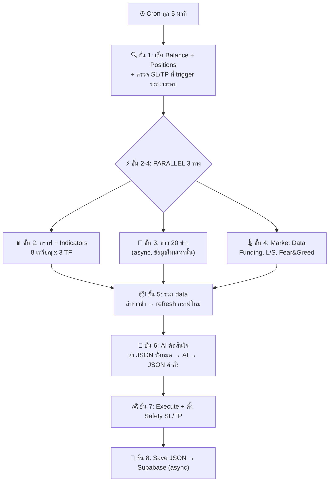
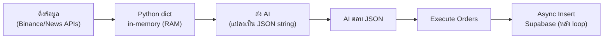

# 🤖 ClawBot AI — Final Implementation Plan (v5)

> **Automation + OpenClaw AI** — ทำเงินได้ทั้ง**ตลาดขาขึ้น (Long) และขาลง (Short)**
> Code = เครื่องมือดึงข้อมูล | **OpenClaw AI = สมอง ตัดสินใจเทรด**
> VPS: 8GB RAM, 2 Core | Cron ทุก 5 นาที | เสร็จ <30 วินาที

---

## 🔄 Workflow ละเอียด



### ขั้น 1: เช็คสถานะ (ไม่ข้ามแม้ balance น้อย!)
- ดึง balance + positions ปัจจุบัน
- **ตรวจ orders ที่ปิดไประหว่าง 5 นาทีที่ไม่ทำงาน** (SL/TP triggered):
  - เช็ค order IDs จากรอบก่อน → ดึงจาก Binance ว่าสถานะเป็นยังไง
  - ถ้า SL/TP trigger → บันทึก PnL, fee, commission ลง Supabase
- **ไม่ข้ามรอบ** → ยังต้อง manage positions เก่า (ปิดกำไร/cut loss/ถือ)

### ขั้น 2-4: PARALLEL (3 ทางพร้อมกัน)

#### ขั้น 2: กราฟ + Indicators (x3 TF = 3 Timeframe)

**3 Timeframe** = ดูกราฟ 3 ขนาดพร้อมกัน:
| TF | 1 แท่ง = | ดึงกี่แท่ง | ครอบคลุม | หน้าที่ |
|----|---------|----------|----------|--------|
| **5m** | 5 นาที | 200 | ~16 ชม. | **หลัก** — หา entry/exit |
| **15m** | 15 นาที | 100 | ~25 ชม. | trend กลาง |
| **1h** | 1 ชม. | 48 | 2 วัน | trend ใหญ่ |

> 3 TF เหมือนดูแผนที่: 1h=ภาพรวม → 15m=ย่าน → 5m=บ้าน

#### ขั้น 3: ข่าว (async — ต้องใหม่!)
- ดึง **20 ข่าวล่าสุด** ทุกข่าวมี `title, source, timestamp, url`
- ถ้าข่าวเสร็จช้า → **กราฟดึงใหม่** ให้เป็นข้อมูลล่าสุด (แทนที่ข้อมูลเก่าเลย)
- ถ้าช้ามาก >15s → ใช้ cache แต่ mark ว่าเป็น `cached` + timestamp

#### ขั้น 4: Market Data + Fear & Greed
**Fear & Greed Index** = ดัชนีวัดอารมณ์ตลาด 0-100:
- 0-24 = Extreme Fear 😱 (อาจเป็นจุดซื้อ) | 75-100 = Extreme Greed 🚀 (อาจเป็นจุดขาย)
- คำนวณจาก: volatility, volume, social media, dominance, trends

### ขั้น 5: รวม Data
- รอกราฟ + market เสร็จ → ถ้าข่าวยังไม่เสร็จก็รอ (max 15s)
- **ถ้าข่าวช้า >5s**: ดึงราคากราฟใหม่ → แทนที่ข้อมูลเก่าเลย (ไม่มี flag พิเศษ)

---

## 📋 Data Format แต่ละขั้นตอน (ต้อง Return อะไร)

> ทุก function ต้อง return **Python dict** (JSON-serializable) ตามมาตรฐานด้านล่าง

### ขั้น 1: `fetch_account_state()` → Account Data

**หน้าที่**: ดึง balance, positions, ตรวจ SL/TP ที่ trigger

**Return Format**:
```python
{
    "data_type": "account",
    "fetched_at": "2026-02-11T01:00:01Z",
    "balance_usdt": 150.42,
    "available_margin": 120.00,
    "positions": [
        {
            "symbol": "BTCUSDT",
            "side": "LONG",
            "binance_order_id": "12345678",
            "entry_price": 97500,
            "current_price": 98200,
            "quantity": 0.002,
            "margin_usdt": 10,
            "leverage": 20,
            "unrealized_pnl": 1.44,
            "unrealized_pnl_pct": 14.4,
            "hold_duration_min": 35,
            "safety_sl_price": 89700,
            "safety_tp_price": 112125
        }
    ],
    "closed_since_last_cycle": [
        {
            "symbol": "ETHUSDT",
            "side": "SHORT",
            "closed_by": "STOP_LOSS",
            "realized_pnl": -2.10,
            "commission": 0.08,
            "note": "SL triggered ระหว่างรอบ"
        }
    ]
}
```

---

### ขั้น 2: `fetch_market_data()` → กราฟ + Indicators (3 TF)

**หน้าที่**: ดึงเทียน 3 timeframe + คำนวณ 12 indicators + regime

**Return Format**:
```python
{
    "data_type": "market_data",
    "fetched_at": "2026-02-11T01:00:00Z",
    "coins": {
        "BTCUSDT": {
            "price": 98200,

            # Indicators TF 5m (หลัก)
            "indicators_5m": {
                "ema9": 98150, "ema21": 97900, "ema55": 97500,
                "rsi14": 65,
                "stoch_rsi_k": 72, "stoch_rsi_d": 68,
                "macd": {"line": 120, "signal": 95, "histogram": 25},
                "bb": {"upper": 98800, "mid": 97700, "lower": 96600, "width": 0.022},
                "atr14": 350, "atr14_pct": 0.36,
                "adx": 32,
                "vwap": 97800,
                "obv": 125000, "obv_trend": "rising",
                "supertrend": {"value": 97200, "direction": "up"},
                "volume_ratio": 1.3
            },

            # Indicators TF 15m (trend กลาง)
            "indicators_15m": {
                "ema9": 98000, "ema21": 97700, "ema55": 97200,
                "rsi14": 60,
                "macd": {"histogram": 50},
                "adx": 28,
                "supertrend": {"direction": "up"}
            },

            # Indicators TF 1h (trend ใหญ่)
            "indicators_1h": {
                "ema9": 97800, "ema21": 97500, "ema200": 95000,
                "rsi14": 58,
                "supertrend": {"direction": "up"},
                "adx": 30
            },

            # Market regime (คำนวณจาก indicators)
            "regime": "trending_up",  # trending_up/trending_down/ranging/volatile

            # Market data เพิ่มเติม
            "funding_rate": 0.0001,
            "long_short_ratio": 1.25,
            "volume_24h_usdt": 1500000000,
            "price_change_5m_pct": 0.15,
            "price_change_1h_pct": 0.8,
            "price_change_24h_pct": 2.3
        },
        "ETHUSDT": { /* เหมือนกัน */ },
        # ... 6 เหรียญอื่น
    }
}
```

---

### ขั้น 3: `fetch_news()` → ข่าว 20 ข่าว

**หน้าที่**: รวมข่าวจาก Telegram + CoinGecko + RSS + CryptoPanic

**Return Format**:
```python
{
    "data_type": "news",
    "fetched_at": "2026-02-11T01:00:05Z",
    "count": 20,
    "sources_used": ["telegram", "coingecko", "rss_coindesk", "rss_cointelegraph"],
    "is_cached": False,  # True ถ้าใช้ cache เพราะดึงช้า >15s
    "news": [
        {
            "id": "news_1",
            "title": "Bitcoin ETF sees $500M inflow",
            "source": "telegram:whale_alert",
            "timestamp": "2026-02-11T00:45:00Z",
            "url": "https://t.me/whale_alert/12345",
            "coins_mentioned": ["BTC"]  # optional
        },
        {
            "id": "news_2",
            "title": "Ethereum upgrade delayed to March",
            "source": "coingecko",
            "timestamp": "2026-02-11T00:40:00Z",
            "url": "https://...",
            "coins_mentioned": ["ETH"]
        }
        # ... 18 ข่าวอื่น
    ]
}
```

**แหล่งข่าว (เรียงตามความเร็ว)**:
1. **Telegram** (10 ข่าว) - เร็วที่สุด, real-time, ใช้ Telethon
2. **CoinGecko** (5 ข่าว) - ข่าวคุณภาพ, free API 30 calls/min
3. **RSS Feeds** (5 ข่าว) - CoinDesk, CoinTelegraph, ไม่มี limit
4. **CryptoPanic** (optional) - เสริม ถ้ายังใช้

---

### ขั้น 4: `fetch_market_sentiment()` → Fear & Greed + Social

**หน้าที่**: ดึง Fear & Greed Index + social sentiment (optional)

**Return Format**:
```python
{
    "data_type": "market_sentiment",
    "fetched_at": "2026-02-11T01:00:03Z",
    "fear_greed": {
        "value": 68,
        "label": "Greed",  # Extreme Fear/Fear/Neutral/Greed/Extreme Greed
        "source": "alternative.me"
    },
    "social_sentiment": {  # optional - จาก LunarCrush
        "twitter_sentiment": 0.65,
        "reddit_sentiment": 0.72,
        "source": "lunarcrush"
    }
}
```

---

### ขั้น 5: `combine_all_data()` → รวมทั้งหมด

**หน้าที่**: รวม data จากขั้น 1-4 เป็น JSON ใหญ่

**Python Code**:
```python
async def combine_all_data(account, market, news, sentiment, balance_usdt):
    """รวม data ทั้งหมดเป็น JSON เดียว"""

    return {
        "cycle_id": f"c_{datetime.now().strftime('%Y%m%d_%H%M')}",
        "timestamp": datetime.now().isoformat(),

        # จากขั้น 1
        "account": {
            "balance_usdt": account["balance_usdt"],
            "available_margin": account["available_margin"],
            "positions": account["positions"],
            "closed_since_last_cycle": account["closed_since_last_cycle"]
        },

        # จากขั้น 2
        "coins": market["coins"],

        # จากขั้น 3
        "news": news["news"],

        # จากขั้น 4
        "fear_greed": sentiment["fear_greed"],

        # Risk config (คำนวณจาก balance)
        "risk_config": calculate_risk_config(balance_usdt)
    }
```

---

### ขั้น 6: `send_to_ai()` → ส่ง AI วิเคราะห์

**Input**: JSON ใหญ่จากขั้น 5 (ทั้งก้อน)

**AI Prompt Template**:
```
You are a crypto trading AI. Analyze the market data and decide actions.

INPUT DATA:
{combined_json}

INSTRUCTIONS:
1. Analyze all 8 coins across 3 timeframes
2. Review news for market sentiment
3. Check Fear & Greed index
4. For existing positions: HOLD, CLOSE, or ADJUST
5. For new positions: OPEN_LONG, OPEN_SHORT, or SKIP
6. Consider risk based on balance tier

OUTPUT FORMAT (must be valid JSON):
{
  "analysis": "Brief market summary...",
  "actions": [
    {
      "symbol": "BTCUSDT",
      "action": "HOLD|CLOSE|OPEN_LONG|OPEN_SHORT",
      "margin_usdt": 12,  // if opening new
      "confidence": 78,
      "reason": "Why this decision..."
    }
  ]
}
```

**AI Response (ต้องได้)**:
```python
{
    "analysis": "ตลาด bullish ทั่วไป BTC trend ชัด ADX 32, ETH breakout...",
    "actions": [
        {
            "symbol": "BTCUSDT",
            "action": "HOLD",
            "confidence": 85,
            "reason": "กำไร 14.4% แต่ RSI 65 ยังไม่ overbought, ADX 32 trend ยังแรง"
        },
        {
            "symbol": "ETHUSDT",
            "action": "OPEN_LONG",
            "margin_usdt": 12,
            "confidence": 78,
            "reason": "EMA 9/21 golden cross + MACD histogram เป็นบวก + ข่าว upgrade"
        },
        {
            "symbol": "SOLUSDT",
            "action": "SKIP",
            "confidence": 45,
            "reason": "RSI 48 กลางๆ, ADX 18 ต่ำเกิน ไม่มี trend ชัด"
        }
    ]
}
```

---

### ขั้น 7: `execute_orders()` → Execute ตาม AI

**Input**: AI response จากขั้น 6

**Python Code**:
```python
async def execute_orders(ai_response, account_data):
    """Execute orders ตาม AI decisions"""

    results = []

    for action in ai_response["actions"]:
        symbol = action["symbol"]
        action_type = action["action"]

        if action_type == "HOLD":
            # ไม่ทำอะไร
            results.append({"symbol": symbol, "status": "held"})

        elif action_type == "CLOSE":
            # ปิด position
            order = await close_position(symbol)
            results.append({
                "symbol": symbol,
                "status": "closed",
                "realized_pnl": order["realized_pnl"]
            })

        elif action_type in ["OPEN_LONG", "OPEN_SHORT"]:
            # เปิด position ใหม่
            side = "BUY" if action_type == "OPEN_LONG" else "SELL"

            # คำนวณ quantity จาก margin + leverage
            quantity = calculate_quantity(
                symbol=symbol,
                margin_usdt=action["margin_usdt"],
                leverage=20
            )

            # เปิด order + ตั้ง Safety SL/TP
            order = await open_position(
                symbol=symbol,
                side=side,
                quantity=quantity
            )

            # ตั้ง Safety SL/TP
            sl_tp = await set_safety_sl_tp(
                symbol=symbol,
                entry_price=order["entry_price"],
                side=side
            )

            results.append({
                "symbol": symbol,
                "status": "opened",
                "order_id": order["order_id"],
                "entry_price": order["entry_price"],
                "sl_price": sl_tp["sl_price"],
                "tp_price": sl_tp["tp_price"]
            })

    return results
```

---

### ขั้น 8: `save_to_supabase()` → บันทึกข้อมูล (async)

**หน้าที่**: บันทึก cycle, raw_data, ai_decision, trades ลง Supabase

**Python Code**:
```python
async def save_to_supabase(cycle_id, combined_data, ai_response, execution_results):
    """บันทึกข้อมูลทั้งหมดลง Supabase (async, ไม่ block main loop)"""

    # 1. บันทึก cycle
    await supabase.table("cycles").insert({
        "cycle_id": cycle_id,
        "started_at": combined_data["timestamp"],
        "balance_usdt": combined_data["account"]["balance_usdt"],
        "actions_taken": len(ai_response["actions"]),
        "orders_opened": len([r for r in execution_results if r["status"] == "opened"]),
        "ai_model": "groq-llama-70b",
        "news_count": len(combined_data["news"])
    })

    # 2. บันทึก raw_data (แต่ละเหรียญ + ข่าว)
    for symbol, data in combined_data["coins"].items():
        await supabase.table("cycle_raw_data").insert({
            "cycle_id": cycle_id,
            "data_type": "indicators_5m",
            "symbol": symbol,
            "raw_json": data["indicators_5m"]
        })

    # 3. บันทึก AI decision
    await supabase.table("ai_decisions").insert({
        "cycle_id": cycle_id,
        "input_json": combined_data,
        "output_json": ai_response,
        "analysis_text": ai_response["analysis"]
    })

    # 4. บันทึก trades
    for result in execution_results:
        if result["status"] in ["opened", "closed"]:
            await supabase.table("trades").insert({
                "cycle_id": cycle_id,
                "symbol": result["symbol"],
                "action": result["status"].upper(),
                "binance_order_id": result.get("order_id"),
                "entry_price": result.get("entry_price")
            })
```

---

## 📦 Data Flow: เก็บยังไง อ่านยังไง (ต้องเร็ว!)



**ขั้นตอนเก็บข้อมูลในแต่ละ cycle:**
1. ดึงข้อมูลจาก API → เก็บเป็น **Python dict ใน RAM** (เร็วที่สุด)
2. คำนวณ indicators → ใส่เข้า dict เดียวกัน
3. แปลง dict → **JSON string** → ส่งให้ AI
4. AI ตอบ JSON → parse กลับเป็น dict
5. Execute orders ตาม dict
6. **หลัง loop เสร็จ**: insert ทั้งก้อนลง Supabase (async, ไม่ block)

> **ไม่เขียนไฟล์ JSON ลง disk** — ช้าเกินไป. Dict ใน RAM เร็วกว่า 1000x
> **ไม่อ่าน Supabase ระหว่าง loop** — ใช้แค่ตอน insert หลังจบ

---

## ⚖️ Safety SL/TP (กัน 5 นาทีที่ไม่ทำงาน)

| ประเภท | ค่า | เหตุผล |
|--------|-----|--------|
| **Safety SL** | -8% จาก entry (ตาม ATR เผื่อไว้) | กัน flash crash ระหว่าง 5 นาทีที่ bot ไม่ทำงาน |
| **Safety TP** | +15% จาก entry (เผื่อสูง) | กัน spike ใหญ่ เก็บกำไรอัตโนมัติ |

> **สำคัญ**: SL/TP นี้เป็นแค่ **safety net** — AI ยังตัดสินใจปิดก่อนถึง SL/TP ทุก 5 นาที
> AI อาจปิดที่ -3% ถ้าเห็นว่า trend ไม่ดี หรือถือต่อถ้ามั่นใจ — ไม่ fix ตายตัว

---

## 🪙 เหรียญ 8 ตัว + Dynamic Discovery

**8 เหรียญหลัก**: BTC, ETH, SOL, BNB, XRP, DOGE, AVAX, LINK

**+ Dynamic**: ถ้ามีเหรียญพุ่ง/ลงแรงผิดปกติ → เพิ่มชั่วคราว (ดึง Binance top movers)

### Correlation:
- BTC+ETH ขึ้นพร้อมกัน = ดี! ทิศเดียวกัน → เปิดได้
- จะ short สวนกระแส? → AI ตรวจ: ถ้ามั่นใจ+มีเหตุผลชัด → เปิดได้ / ไม่มั่นใจ → ข้าม

---

## 🤖 AI Model เปรียบเทียบ

| Model | Input/MTok | Output/MTok | ต่อ call | ต่อเดือน (288/วัน) | ดีตรงไหน | เหมาะกับเรา? |
|-------|-----------|------------|---------|-------------------|----------|-------------|
| **Groq Llama 3.1 8B** | $0.05 | $0.08 | ~$0.0002 | **FREE** | เร็วมาก 800tok/s | ✅ ทดสอบก่อน |
| **Groq Llama 3.3 70B** | $0.59 | $0.79 | ~$0.002 | **~$17** | ฉลาดกว่า 8B มาก | ✅ **แนะนำเริ่ม** |
| **DeepSeek V3.2** | $0.28 | $0.42 | ~$0.001 | **~$8** | ถูกมาก, วิเคราะห์เก่ง | ✅ ถูกที่สุดที่ฉลาด |
| **Kimi K2.5** | $0.60 | $2.50 | ~$0.003 | **~$25** | context window ใหญ่ 262K | ⚠️ แพงกว่า DeepSeek |
| **Gemini 2.5 Flash-Lite** | $0.10 | $0.40 | ~$0.0005 | **FREE** tier | Google, multimodal | ✅ backup ฟรี |
| **Gemini 2.5 Flash** | $0.30 | $2.50 | ~$0.002 | **~$17** | reasoning ดี | ✅ ทางเลือก |
| **Claude Haiku 3.5** | $0.80 | $4.00 | ~$0.004 | **~$35** | วิเคราะห์ละเอียด | ⚠️ แพงขึ้น |
| **Claude Sonnet 4.5** | $3.00 | $15.00 | ~$0.017 | **~$147** | ฉลาดที่สุด | ❌ แพงเกินสำหรับ 288 calls/วัน |

### สรุปแนะนำ:
1. **เริ่มต้น**: Groq Llama 8B (FREE) → ทดสอบระบบก่อน
2. **ใช้จริง**: **DeepSeek V3.2** (~$8/เดือน) หรือ **Groq 70B** (~$17/เดือน) — คุ้มค่าที่สุด
3. **อยากแม่นกว่า**: Claude Haiku (~$35/เดือน) — reasoning ดีกว่า
4. **Kimi K2.5** (~$25/เดือน) — ดีแต่ DeepSeek ถูกกว่าและเก่งเท่ากัน

> **ระบบ configurable**: เปลี่ยน model ได้ใน .env ไม่ต้องแก้โค้ด

---

## 📰 แหล่งข่าว 20 ข่าว

| # | Source | วิธีดึง | Rate Limit | Block Bot? |
|---|--------|--------|-----------|------------|
| 1 | **CryptoPanic API** | REST + free key | ไม่จำกัด | ❌ |
| 2 | **CryptoPanic RSS** | RSS parser | ไม่จำกัด | ❌ |
| 3 | **free-crypto-news** | REST no key | ไม่จำกัด | ❌ |
| 4 | **CoinDesk RSS** | RSS | ไม่จำกัด | ❌ |
| 5 | **CoinTelegraph RSS** | RSS | ไม่จำกัด | ❌ |
| 6 | **Binance Blog RSS** | RSS | ไม่จำกัด | ❌ |

ดึงข่าว crypto รวม (ไม่แยกเหรียญ) → 20 ข่าว + timestamp + source

---

## 📊 Indicators 12 ตัว

| # | ชื่อ | คืออะไร | ใช้ทำอะไร |
|---|------|--------|----------|
| 1 | **EMA 9/21/55** | เส้นค่าเฉลี่ยเคลื่อนที่ (ถ่วงน้ำหนักล่าสุด) | จับ trend + crossover signals |
| 2 | **RSI 14** | วัดแรงซื้อ/ขาย (0-100) | >70 overbought, <30 oversold |
| 3 | **MACD** | momentum 2 เส้น | crossover = เปลี่ยน momentum |
| 4 | **Bollinger Bands** | แถบ volatility รอบราคา | ชน band = อาจกลับตัว |
| 5 | **ATR 14** | ความผันผวนเฉลี่ย ($) | กำหนด Safety SL/TP dynamic |
| 6 | **VWAP** | ราคาเฉลี่ยถ่วง volume | ดู institutional level |
| 7 | **ADX** | ความแรง trend (0-100) | >25 trend ชัด, <20 sideway |
| 8 | **Stoch RSI** | RSI ของ RSI (ไวกว่า) | จับกลับตัวสั้นๆ เร็ว |
| 9 | **OBV** | volume สะสม | divergence = ราคาอาจกลับ |
| 10 | **Supertrend** | trend line จาก ATR | เขียว=buy zone, แดง=sell zone |
| 11 | **Volume Profile** | volume ตามระดับราคา | หา support/resistance จริง |
| 12 | **EMA 200** (1h) | trend ภาพรวมใหญ่ | ราคา > EMA200 = bullish |

---

## 🤖 JSON Format สำหรับ AI

### Input JSON (Code → AI)
```json
{
  "cycle_id": "c_20260211_0100",
  "timestamp": "2026-02-11T01:00:00Z",
  "account": {
    "balance_usdt": 150.42,
    "available_margin": 120.00,
    "positions": [
      {
        "symbol": "BTCUSDT", "side": "LONG",
        "binance_order_id": "12345678",
        "entry_price": 97500, "current_price": 98200,
        "quantity": 0.002, "margin_usdt": 10, "leverage": 20,
        "unrealized_pnl": 1.44, "unrealized_pnl_pct": 14.4,
        "hold_duration_min": 35,
        "safety_sl_price": 89700, "safety_tp_price": 112125
      }
    ],
    "closed_since_last_cycle": [
      {
        "symbol": "ETHUSDT", "side": "SHORT",
        "closed_by": "STOP_LOSS",
        "realized_pnl": -2.10, "commission": 0.08,
        "note": "SL triggered ระหว่างรอบ"
      }
    ]
  },
  "coins": {
    "BTCUSDT": {
      "price": 98200,
      "indicators_5m": {
        "ema9": 98150, "ema21": 97900, "ema55": 97500,
        "rsi14": 65, "stoch_rsi_k": 72, "stoch_rsi_d": 68,
        "macd": {"line": 120, "signal": 95, "histogram": 25},
        "bb": {"upper": 98800, "mid": 97700, "lower": 96600, "width": 0.022},
        "atr14": 350, "atr14_pct": 0.36,
        "adx": 32, "vwap": 97800,
        "obv": 125000, "obv_trend": "rising",
        "supertrend": {"value": 97200, "direction": "up"},
        "volume_ratio": 1.3
      },
      "indicators_15m": {
        "ema9": 98000, "ema21": 97700, "rsi14": 60,
        "macd_histogram": 50, "adx": 28
      },
      "indicators_1h": {
        "ema9": 97800, "ema21": 97500, "ema200": 95000,
        "rsi14": 58, "supertrend_dir": "up"
      },
      "regime": "trending_up",
      "funding_rate": 0.0001,
      "long_short_ratio": 1.25,
      "volume_24h_usdt": 1500000000,
      "price_change_5m_pct": 0.15,
      "price_change_1h_pct": 0.8,
      "price_change_24h_pct": 2.3
    }
  },
  "news": [
    {
      "title": "Bitcoin ETF sees $500M inflow",
      "source": "CoinDesk",
      "timestamp": "2026-02-11T00:45:00Z",
      "url": "https://..."
    }
  ],
  "fear_greed": {"value": 68, "label": "Greed"},
  "risk_config": {
    "balance_tier": "$100-300",
    "suggested_risk_pct": "5-8%",
    "min_order_usdt": 5
  }
}
```

### Output JSON (AI → Code)
```json
{
  "analysis": "ตลาด bullish BTC trend ชัด ADX 32...",
  "actions": [
    {
      "symbol": "BTCUSDT",
      "action": "HOLD",
      "reason": "กำไร 14.4% แต่ RSI 65 ยังไม่ overbought trend ยังแรง ถือต่อ"
    },
    {
      "symbol": "ETHUSDT",
      "action": "OPEN_LONG",
      "margin_usdt": 12,
      "confidence": 78,
      "reason": "EMA cross + MACD bullish + ตลาดรวมขึ้น"
    }
  ]
}
```

---

## ⚖️ Risk Management

### Dynamic ตาม Balance
| Balance | Risk/Trade |
|---------|-----------|
| < $50 | 15-20% |
| $50-100 | 10% |
| $100-300 | 5-8% |
| $300-1000 | 3-5% |
| > $1000 | 2-3% |

- **ไม่มี daily loss limit** — AI ดูสถานการณ์เอง
- แพ้หลายไม้ → ถ้ามั่นใจ → เล่นต่อ

---

## 💾 Supabase Schema (สำหรับ Dashboard ดูย้อนหลัง)

### `cycles` — ทุก cycle ดูได้ว่าทำอะไร
```sql
CREATE TABLE cycles (
    id UUID PRIMARY KEY DEFAULT gen_random_uuid(),
    cycle_number BIGINT NOT NULL,
    started_at TIMESTAMPTZ NOT NULL,
    completed_at TIMESTAMPTZ,
    duration_ms INT,
    
    -- Account snapshot ตอนเริ่ม cycle
    balance_usdt DECIMAL(18,4),
    available_margin DECIMAL(18,4),
    positions_count INT,
    
    -- สรุปสิ่งที่เกิดขึ้น
    actions_taken INT DEFAULT 0,        -- AI สั่งกี่ actions
    orders_opened INT DEFAULT 0,
    orders_closed INT DEFAULT 0,
    sl_tp_triggered INT DEFAULT 0,      -- มี SL/TP trigger ระหว่างรอบไหม
    
    -- AI
    ai_model TEXT,
    ai_latency_ms INT,
    ai_cost_usd DECIMAL(10,6),
    
    -- ข่าว
    news_count INT,
    news_is_cached BOOLEAN DEFAULT false,
    fear_greed_value INT,
    
    status TEXT DEFAULT 'running'       -- running/completed/error
);
```

### `cycle_raw_data` — ข้อมูลดิบ+แปลงแล้ว ทุก cycle
```sql
CREATE TABLE cycle_raw_data (
    id UUID PRIMARY KEY DEFAULT gen_random_uuid(),
    cycle_id UUID REFERENCES cycles(id),
    data_type TEXT NOT NULL,            -- 'indicators_5m'/'indicators_15m'/'indicators_1h'/'news'/'market'/'positions'/'fear_greed'
    symbol TEXT,                        -- BTCUSDT etc. (null สำหรับ news)
    raw_json JSONB NOT NULL,            -- ข้อมูลดิบที่ได้มา
    processed_json JSONB,               -- ข้อมูลหลังคำนวณ
    source TEXT NOT NULL,               -- 'binance'/'cryptopanic'/'coindesk_rss'
    source_timestamp TIMESTAMPTZ,       -- timestamp ของข้อมูลจริงจากแหล่ง
    fetched_at TIMESTAMPTZ NOT NULL     -- เราดึงมาเมื่อไหร่
);
```

### `ai_decisions` — ดู prompt + AI คิดอะไร ย้อนหลัง
```sql
CREATE TABLE ai_decisions (
    id UUID PRIMARY KEY DEFAULT gen_random_uuid(),
    cycle_id UUID REFERENCES cycles(id),
    model_used TEXT NOT NULL,
    prompt_tokens INT,
    completion_tokens INT,
    cost_usd DECIMAL(10,6),
    input_json JSONB,                   -- JSON ทั้งก้อนที่ส่ง AI (ดิบ)
    output_json JSONB,                  -- AI ตอบอะไร (ดิบ)
    analysis_text TEXT,                 -- AI วิเคราะห์สรุป
    actions JSONB,                      -- parsed actions
    latency_ms INT,
    created_at TIMESTAMPTZ DEFAULT now()
);
```

### `trades` — ทุก order + Binance data จริง
```sql
CREATE TABLE trades (
    id UUID PRIMARY KEY DEFAULT gen_random_uuid(),
    cycle_id UUID REFERENCES cycles(id),  -- มาจาก cycle ไหน
    
    -- Binance data จริง
    binance_order_id TEXT,              -- order ID จาก Binance
    binance_client_order_id TEXT,
    symbol TEXT NOT NULL,
    side TEXT NOT NULL,                 -- 'BUY'/'SELL'
    position_side TEXT,                 -- 'LONG'/'SHORT'
    order_type TEXT,                    -- 'MARKET'/'LIMIT'
    
    -- ราคา
    entry_price DECIMAL(18,8),
    exit_price DECIMAL(18,8),
    quantity DECIMAL(18,8),
    margin_usdt DECIMAL(18,4),
    leverage INT DEFAULT 20,
    
    -- PnL จาก Binance (ค่าจริง)
    realized_pnl DECIMAL(18,4),
    realized_pnl_pct DECIMAL(8,4),
    commission DECIMAL(18,8),           -- ค่า commission จาก Binance
    commission_asset TEXT,              -- USDT/BNB
    
    -- AI context
    ai_confidence INT,                  -- AI มั่นใจแค่ไหน
    ai_reason TEXT,                     -- ทำไม AI ถึงเทรด
    regime TEXT,                        -- trending_up/trending_down/ranging/volatile
    counter_trend BOOLEAN DEFAULT false,
    
    -- ถ้าปิดโดย SL/TP ระหว่างรอบ
    closed_by TEXT,                     -- 'AI'/'STOP_LOSS'/'TAKE_PROFIT'
    hold_duration_min INT,
    
    -- Safety SL/TP ที่ตั้งไว้
    sl_price DECIMAL(18,8),
    tp_price DECIMAL(18,8),
    
    action TEXT NOT NULL,               -- 'OPEN'/'CLOSE'
    executed_at TIMESTAMPTZ NOT NULL,
    balance_after DECIMAL(18,4)         -- balance หลังเทรดเสร็จ
);
```

### `daily_summary` — สรุปรายวัน
```sql
CREATE TABLE daily_summary (
    id UUID PRIMARY KEY DEFAULT gen_random_uuid(),
    date DATE NOT NULL UNIQUE,
    total_cycles INT,
    total_trades INT,
    winning_trades INT, losing_trades INT,
    win_rate DECIMAL(5,2),
    total_pnl DECIMAL(18,4),
    total_commission DECIMAL(18,4),
    net_pnl DECIMAL(18,4),
    best_trade DECIMAL(18,4), worst_trade DECIMAL(18,4),
    avg_hold_min INT, avg_confidence INT,
    ai_cost_usd DECIMAL(10,4),
    balance_start DECIMAL(18,4), balance_end DECIMAL(18,4),
    created_at TIMESTAMPTZ DEFAULT now()
);
```

> **ดูย้อนหลังได้**: cycle → raw_data → ai_decision → trades → **รู้ว่าแพ้ชนะเพราะอะไร**

---

## 🔧 OpenClaw Skills 6 ตัว

| Skill | หน้าที่ |
|-------|--------|
| `clawbot-market-data` | ดึงกราฟ 3TF x 8เหรียญ + 12 indicators + regime |
| `clawbot-news` | ดึง 20 ข่าว + Fear&Greed + timestamp |
| `clawbot-account` | ดึง balance, positions, ตรวจ SL/TP triggered |
| `clawbot-execute` | เปิด/ปิด order + ตั้ง safety SL/TP |
| `clawbot-risk` | คำนวณ position size ตาม balance tier |
| `clawbot-notify` | Telegram + Discord |

---

## 📁 Project Structure

```
24openClaw/
├── main.py
├── requirements.txt
├── .env.example
├── supabase_schema.sql
├── .agent/skills/  (6 skills)
├── src/
│   ├── core/engine.py          # Main loop orchestrator
│   ├── data/
│   │   ├── binance_rest.py     # HMAC signed, self-written
│   │   ├── candle_store.py     # Multi-TF management
│   │   └── news_fetcher.py     # CryptoPanic + RSS
│   ├── strategy/
│   │   ├── indicators.py       # 12 indicators
│   │   └── regime.py           # Market regime
│   ├── ai/
│   │   ├── brain.py            # JSON → AI → JSON
│   │   └── prompts.py          # Prompt templates
│   ├── execution/
│   │   ├── order_manager.py    # Execute + safety SL/TP
│   │   └── position_tracker.py # Track + detect SL/TP trigger
│   ├── database/repository.py  # Async Supabase insert
│   └── utils/
│       ├── config.py
│       ├── logger.py
│       ├── cache.py            # Python dict in-memory
│       └── notifier.py         # Telegram + Discord
└── tests/
```

## ⚙️ Cron
```bash
*/5 * * * * cd /path/24openClaw && python main.py >> logs/cron.log 2>&1
```

## Verification
1. `python main.py --dry-run`
2. Binance Testnet 24h
3. Live: margin $4-5 (start small)
