# 🤖 ClawBot AI — Final Implementation Plan (v5)

> **Automation + OpenClaw AI** — ทำเงินได้ทั้ง**ตลาดขาขึ้น (Long) และขาลง (Short)**
> Code = เครื่องมือดึงข้อมูล | **OpenClaw AI = สมอง ตัดสินใจเทรด**
> VPS: 8GB RAM, 2 Core | Cron ทุก 5 นาที | เสร็จ <30 วินาที

---

## 🔄 Workflow ละเอียด

```mermaid
graph TD
    CRON["⏰ Cron ทุก 5 นาที"] --> S1["🔍 ขั้น 1: เช็ค Balance + Positions<br/>+ ตรวจ SL/TP ที่ trigger ระหว่างรอบ"]
    S1 --> PAR{"⚡ ขั้น 2-4: PARALLEL 3 ทาง"}
    PAR --> S2["📊 ขั้น 2: กราฟ + Indicators<br/>8 เหรียญ x 3 TF"]
    PAR --> S3["📰 ขั้น 3: ข่าว 20 ข่าว<br/>(async, ข้อมูลใหม่เท่านั้น)"]
    PAR --> S4["🌡️ ขั้น 4: Market Data<br/>Funding, L/S, Fear&Greed"]
    S2 --> WAIT["📦 ขั้น 5: รวม data<br/>ถ้าข่าวช้า → refresh กราฟใหม่"]
    S3 --> WAIT
    S4 --> WAIT
    WAIT --> AI["🤖 ขั้น 6: AI ตัดสินใจ<br/>ส่ง JSON ทั้งหมด → AI → JSON คำสั่ง"]
    AI --> EXEC["💰 ขั้น 7: Execute + ตั้ง Safety SL/TP"]
    EXEC --> SAVE["💾 ขั้น 8: Save JSON → Supabase (async)"]
```



### ขั้น 1: เช็คสถานะ (ไม่ข้ามแม้ balance น้อย!)
- ดึง balance + positions ปัจจุบัน
- **ตรวจ orders ที่ปิดไประหว่าง 5 นาทีที่ไม่ทำงาน** (SL/TP triggered):
  - เช็ค order IDs จากรอบก่อน → ดึงจาก Binance ว่าสถานะเป็นยังไง
  - ถ้า SL/TP trigger → บันทึก PnL, fee, commission ลง Supabase
- **ไม่ข้ามรอบ** → ยังต้อง manage positions เก่า (ปิดกำไร/cut loss/ถือ)

### ขั้น 2-4: PARALLEL (3 ทางพร้อมกัน)

#### ขั้น 2: กราฟ + Indicators (x3 TF = 3 Timeframe)

**3 Timeframe** = ดูกราฟ 3 ขนาดพร้อมกัน:
| TF | 1 แท่ง = | ดึงกี่แท่ง | ครอบคลุม | หน้าที่ |
|----|---------|----------|----------|--------|
| **5m** | 5 นาที | 200 | ~16 ชม. | **หลัก** — หา entry/exit |
| **15m** | 15 นาที | 100 | ~25 ชม. | trend กลาง |
| **1h** | 1 ชม. | 48 | 2 วัน | trend ใหญ่ |

> 3 TF เหมือนดูแผนที่: 1h=ภาพรวม → 15m=ย่าน → 5m=บ้าน

#### ขั้น 3: ข่าว (async — ต้องใหม่!)
- ดึง **20 ข่าวล่าสุด** ทุกข่าวมี `title, source, timestamp, url`
- ถ้าข่าวเสร็จช้า → **กราฟดึงใหม่** ให้เป็นข้อมูลล่าสุด (แทนที่ข้อมูลเก่าเลย)
- ถ้าช้ามาก >15s → ใช้ cache แต่ mark ว่าเป็น `cached` + timestamp

#### ขั้น 4: Market Data + Fear & Greed
**Fear & Greed Index** = ดัชนีวัดอารมณ์ตลาด 0-100:
- 0-24 = Extreme Fear 😱 (อาจเป็นจุดซื้อ) | 75-100 = Extreme Greed 🚀 (อาจเป็นจุดขาย)
- คำนวณจาก: volatility, volume, social media, dominance, trends

### ขั้น 5: รวม Data
- รอกราฟ + market เสร็จ → ถ้าข่าวยังไม่เสร็จก็รอ (max 15s)
- **ถ้าข่าวช้า >5s**: ดึงราคากราฟใหม่ → แทนที่ข้อมูลเก่าเลย (ไม่มี flag พิเศษ)

---

## 📦 Data Flow: เก็บยังไง อ่านยังไง (ต้องเร็ว!)

```mermaid
graph LR
    FETCH["ดึงข้อมูล<br/>(Binance/News APIs)"] --> DICT["Python dict<br/>in-memory (RAM)"]
    DICT --> AI["ส่ง AI<br/>(แปลงเป็น JSON string)"]
    AI --> RESULT["AI ตอบ JSON"]
    RESULT --> EXEC["Execute Orders"]
    EXEC --> SUPA["Async Insert<br/>Supabase (หลัง loop)"]
```



**ขั้นตอนเก็บข้อมูลในแต่ละ cycle:**
1. ดึงข้อมูลจาก API → เก็บเป็น **Python dict ใน RAM** (เร็วที่สุด)
2. คำนวณ indicators → ใส่เข้า dict เดียวกัน
3. แปลง dict → **JSON string** → ส่งให้ AI
4. AI ตอบ JSON → parse กลับเป็น dict
5. Execute orders ตาม dict
6. **หลัง loop เสร็จ**: insert ทั้งก้อนลง Supabase (async, ไม่ block)

> **ไม่เขียนไฟล์ JSON ลง disk** — ช้าเกินไป. Dict ใน RAM เร็วกว่า 1000x
> **ไม่อ่าน Supabase ระหว่าง loop** — ใช้แค่ตอน insert หลังจบ

---

## ⚖️ Safety SL/TP (กัน 5 นาทีที่ไม่ทำงาน)

| ประเภท | ค่า | เหตุผล |
|--------|-----|--------|
| **Safety SL** | -8% จาก entry (ตาม ATR เผื่อไว้) | กัน flash crash ระหว่าง 5 นาทีที่ bot ไม่ทำงาน |
| **Safety TP** | +15% จาก entry (เผื่อสูง) | กัน spike ใหญ่ เก็บกำไรอัตโนมัติ |

> **สำคัญ**: SL/TP นี้เป็นแค่ **safety net** — AI ยังตัดสินใจปิดก่อนถึง SL/TP ทุก 5 นาที
> AI อาจปิดที่ -3% ถ้าเห็นว่า trend ไม่ดี หรือถือต่อถ้ามั่นใจ — ไม่ fix ตายตัว

---

## 🪙 เหรียญ 8 ตัว + Dynamic Discovery

**8 เหรียญหลัก**: BTC, ETH, SOL, BNB, XRP, DOGE, AVAX, LINK

**+ Dynamic**: ถ้ามีเหรียญพุ่ง/ลงแรงผิดปกติ → เพิ่มชั่วคราว (ดึง Binance top movers)

### Correlation:
- BTC+ETH ขึ้นพร้อมกัน = ดี! ทิศเดียวกัน → เปิดได้
- จะ short สวนกระแส? → AI ตรวจ: ถ้ามั่นใจ+มีเหตุผลชัด → เปิดได้ / ไม่มั่นใจ → ข้าม

---

## 🤖 AI Model เปรียบเทียบ

| Model | Input/MTok | Output/MTok | ต่อ call | ต่อเดือน (288/วัน) | ดีตรงไหน | เหมาะกับเรา? |
|-------|-----------|------------|---------|-------------------|----------|-------------|
| **Groq Llama 3.1 8B** | $0.05 | $0.08 | ~$0.0002 | **FREE** | เร็วมาก 800tok/s | ✅ ทดสอบก่อน |
| **Groq Llama 3.3 70B** | $0.59 | $0.79 | ~$0.002 | **~$17** | ฉลาดกว่า 8B มาก | ✅ **แนะนำเริ่ม** |
| **DeepSeek V3.2** | $0.28 | $0.42 | ~$0.001 | **~$8** | ถูกมาก, วิเคราะห์เก่ง | ✅ ถูกที่สุดที่ฉลาด |
| **Kimi K2.5** | $0.60 | $2.50 | ~$0.003 | **~$25** | context window ใหญ่ 262K | ⚠️ แพงกว่า DeepSeek |
| **Gemini 2.5 Flash-Lite** | $0.10 | $0.40 | ~$0.0005 | **FREE** tier | Google, multimodal | ✅ backup ฟรี |
| **Gemini 2.5 Flash** | $0.30 | $2.50 | ~$0.002 | **~$17** | reasoning ดี | ✅ ทางเลือก |
| **Claude Haiku 3.5** | $0.80 | $4.00 | ~$0.004 | **~$35** | วิเคราะห์ละเอียด | ⚠️ แพงขึ้น |
| **Claude Sonnet 4.5** | $3.00 | $15.00 | ~$0.017 | **~$147** | ฉลาดที่สุด | ❌ แพงเกินสำหรับ 288 calls/วัน |

### สรุปแนะนำ:
1. **เริ่มต้น**: Groq Llama 8B (FREE) → ทดสอบระบบก่อน
2. **ใช้จริง**: **DeepSeek V3.2** (~$8/เดือน) หรือ **Groq 70B** (~$17/เดือน) — คุ้มค่าที่สุด
3. **อยากแม่นกว่า**: Claude Haiku (~$35/เดือน) — reasoning ดีกว่า
4. **Kimi K2.5** (~$25/เดือน) — ดีแต่ DeepSeek ถูกกว่าและเก่งเท่ากัน

> **ระบบ configurable**: เปลี่ยน model ได้ใน .env ไม่ต้องแก้โค้ด

---

## 📰 แหล่งข่าว 20 ข่าว

| # | Source | วิธีดึง | Rate Limit | Block Bot? |
|---|--------|--------|-----------|------------|
| 1 | **CryptoPanic API** | REST + free key | ไม่จำกัด | ❌ |
| 2 | **CryptoPanic RSS** | RSS parser | ไม่จำกัด | ❌ |
| 3 | **free-crypto-news** | REST no key | ไม่จำกัด | ❌ |
| 4 | **CoinDesk RSS** | RSS | ไม่จำกัด | ❌ |
| 5 | **CoinTelegraph RSS** | RSS | ไม่จำกัด | ❌ |
| 6 | **Binance Blog RSS** | RSS | ไม่จำกัด | ❌ |

ดึงข่าว crypto รวม (ไม่แยกเหรียญ) → 20 ข่าว + timestamp + source

---

## 📊 Indicators 12 ตัว

| # | ชื่อ | คืออะไร | ใช้ทำอะไร |
|---|------|--------|----------|
| 1 | **EMA 9/21/55** | เส้นค่าเฉลี่ยเคลื่อนที่ (ถ่วงน้ำหนักล่าสุด) | จับ trend + crossover signals |
| 2 | **RSI 14** | วัดแรงซื้อ/ขาย (0-100) | >70 overbought, <30 oversold |
| 3 | **MACD** | momentum 2 เส้น | crossover = เปลี่ยน momentum |
| 4 | **Bollinger Bands** | แถบ volatility รอบราคา | ชน band = อาจกลับตัว |
| 5 | **ATR 14** | ความผันผวนเฉลี่ย ($) | กำหนด Safety SL/TP dynamic |
| 6 | **VWAP** | ราคาเฉลี่ยถ่วง volume | ดู institutional level |
| 7 | **ADX** | ความแรง trend (0-100) | >25 trend ชัด, <20 sideway |
| 8 | **Stoch RSI** | RSI ของ RSI (ไวกว่า) | จับกลับตัวสั้นๆ เร็ว |
| 9 | **OBV** | volume สะสม | divergence = ราคาอาจกลับ |
| 10 | **Supertrend** | trend line จาก ATR | เขียว=buy zone, แดง=sell zone |
| 11 | **Volume Profile** | volume ตามระดับราคา | หา support/resistance จริง |
| 12 | **EMA 200** (1h) | trend ภาพรวมใหญ่ | ราคา > EMA200 = bullish |

---

## 🤖 JSON Format สำหรับ AI

### Input JSON (Code → AI)
```json
{
  "cycle_id": "c_20260211_0100",
  "timestamp": "2026-02-11T01:00:00Z",
  "account": {
    "balance_usdt": 150.42,
    "available_margin": 120.00,
    "positions": [
      {
        "symbol": "BTCUSDT", "side": "LONG",
        "binance_order_id": "12345678",
        "entry_price": 97500, "current_price": 98200,
        "quantity": 0.002, "margin_usdt": 10, "leverage": 20,
        "unrealized_pnl": 1.44, "unrealized_pnl_pct": 14.4,
        "hold_duration_min": 35,
        "safety_sl_price": 89700, "safety_tp_price": 112125
      }
    ],
    "closed_since_last_cycle": [
      {
        "symbol": "ETHUSDT", "side": "SHORT",
        "closed_by": "STOP_LOSS",
        "realized_pnl": -2.10, "commission": 0.08,
        "note": "SL triggered ระหว่างรอบ"
      }
    ]
  },
  "coins": {
    "BTCUSDT": {
      "price": 98200,
      "indicators_5m": {
        "ema9": 98150, "ema21": 97900, "ema55": 97500,
        "rsi14": 65, "stoch_rsi_k": 72, "stoch_rsi_d": 68,
        "macd": {"line": 120, "signal": 95, "histogram": 25},
        "bb": {"upper": 98800, "mid": 97700, "lower": 96600, "width": 0.022},
        "atr14": 350, "atr14_pct": 0.36,
        "adx": 32, "vwap": 97800,
        "obv": 125000, "obv_trend": "rising",
        "supertrend": {"value": 97200, "direction": "up"},
        "volume_ratio": 1.3
      },
      "indicators_15m": {
        "ema9": 98000, "ema21": 97700, "rsi14": 60,
        "macd_histogram": 50, "adx": 28
      },
      "indicators_1h": {
        "ema9": 97800, "ema21": 97500, "ema200": 95000,
        "rsi14": 58, "supertrend_dir": "up"
      },
      "regime": "trending_up",
      "funding_rate": 0.0001,
      "long_short_ratio": 1.25,
      "volume_24h_usdt": 1500000000,
      "price_change_5m_pct": 0.15,
      "price_change_1h_pct": 0.8,
      "price_change_24h_pct": 2.3
    }
  },
  "news": [
    {
      "title": "Bitcoin ETF sees $500M inflow",
      "source": "CoinDesk",
      "timestamp": "2026-02-11T00:45:00Z",
      "url": "https://..."
    }
  ],
  "fear_greed": {"value": 68, "label": "Greed"},
  "risk_config": {
    "balance_tier": "$100-300",
    "suggested_risk_pct": "5-8%",
    "min_order_usdt": 5
  }
}
```

### Output JSON (AI → Code)
```json
{
  "analysis": "ตลาด bullish BTC trend ชัด ADX 32...",
  "actions": [
    {
      "symbol": "BTCUSDT",
      "action": "HOLD",
      "reason": "กำไร 14.4% แต่ RSI 65 ยังไม่ overbought trend ยังแรง ถือต่อ"
    },
    {
      "symbol": "ETHUSDT",
      "action": "OPEN_LONG",
      "margin_usdt": 12,
      "confidence": 78,
      "reason": "EMA cross + MACD bullish + ตลาดรวมขึ้น"
    }
  ]
}
```

---

## ⚖️ Risk Management

### Dynamic ตาม Balance
| Balance | Risk/Trade |
|---------|-----------|
| < $50 | 15-20% |
| $50-100 | 10% |
| $100-300 | 5-8% |
| $300-1000 | 3-5% |
| > $1000 | 2-3% |

- **ไม่มี daily loss limit** — AI ดูสถานการณ์เอง
- แพ้หลายไม้ → ถ้ามั่นใจ → เล่นต่อ

---

## 💾 Supabase Schema (สำหรับ Dashboard ดูย้อนหลัง)

### `cycles` — ทุก cycle ดูได้ว่าทำอะไร
```sql
CREATE TABLE cycles (
    id UUID PRIMARY KEY DEFAULT gen_random_uuid(),
    cycle_number BIGINT NOT NULL,
    started_at TIMESTAMPTZ NOT NULL,
    completed_at TIMESTAMPTZ,
    duration_ms INT,
    
    -- Account snapshot ตอนเริ่ม cycle
    balance_usdt DECIMAL(18,4),
    available_margin DECIMAL(18,4),
    positions_count INT,
    
    -- สรุปสิ่งที่เกิดขึ้น
    actions_taken INT DEFAULT 0,        -- AI สั่งกี่ actions
    orders_opened INT DEFAULT 0,
    orders_closed INT DEFAULT 0,
    sl_tp_triggered INT DEFAULT 0,      -- มี SL/TP trigger ระหว่างรอบไหม
    
    -- AI
    ai_model TEXT,
    ai_latency_ms INT,
    ai_cost_usd DECIMAL(10,6),
    
    -- ข่าว
    news_count INT,
    news_is_cached BOOLEAN DEFAULT false,
    fear_greed_value INT,
    
    status TEXT DEFAULT 'running'       -- running/completed/error
);
```

### `cycle_raw_data` — ข้อมูลดิบ+แปลงแล้ว ทุก cycle
```sql
CREATE TABLE cycle_raw_data (
    id UUID PRIMARY KEY DEFAULT gen_random_uuid(),
    cycle_id UUID REFERENCES cycles(id),
    data_type TEXT NOT NULL,            -- 'indicators_5m'/'indicators_15m'/'indicators_1h'/'news'/'market'/'positions'/'fear_greed'
    symbol TEXT,                        -- BTCUSDT etc. (null สำหรับ news)
    raw_json JSONB NOT NULL,            -- ข้อมูลดิบที่ได้มา
    processed_json JSONB,               -- ข้อมูลหลังคำนวณ
    source TEXT NOT NULL,               -- 'binance'/'cryptopanic'/'coindesk_rss'
    source_timestamp TIMESTAMPTZ,       -- timestamp ของข้อมูลจริงจากแหล่ง
    fetched_at TIMESTAMPTZ NOT NULL     -- เราดึงมาเมื่อไหร่
);
```

### `ai_decisions` — ดู prompt + AI คิดอะไร ย้อนหลัง
```sql
CREATE TABLE ai_decisions (
    id UUID PRIMARY KEY DEFAULT gen_random_uuid(),
    cycle_id UUID REFERENCES cycles(id),
    model_used TEXT NOT NULL,
    prompt_tokens INT,
    completion_tokens INT,
    cost_usd DECIMAL(10,6),
    input_json JSONB,                   -- JSON ทั้งก้อนที่ส่ง AI (ดิบ)
    output_json JSONB,                  -- AI ตอบอะไร (ดิบ)
    analysis_text TEXT,                 -- AI วิเคราะห์สรุป
    actions JSONB,                      -- parsed actions
    latency_ms INT,
    created_at TIMESTAMPTZ DEFAULT now()
);
```

### `trades` — ทุก order + Binance data จริง
```sql
CREATE TABLE trades (
    id UUID PRIMARY KEY DEFAULT gen_random_uuid(),
    cycle_id UUID REFERENCES cycles(id),  -- มาจาก cycle ไหน
    
    -- Binance data จริง
    binance_order_id TEXT,              -- order ID จาก Binance
    binance_client_order_id TEXT,
    symbol TEXT NOT NULL,
    side TEXT NOT NULL,                 -- 'BUY'/'SELL'
    position_side TEXT,                 -- 'LONG'/'SHORT'
    order_type TEXT,                    -- 'MARKET'/'LIMIT'
    
    -- ราคา
    entry_price DECIMAL(18,8),
    exit_price DECIMAL(18,8),
    quantity DECIMAL(18,8),
    margin_usdt DECIMAL(18,4),
    leverage INT DEFAULT 20,
    
    -- PnL จาก Binance (ค่าจริง)
    realized_pnl DECIMAL(18,4),
    realized_pnl_pct DECIMAL(8,4),
    commission DECIMAL(18,8),           -- ค่า commission จาก Binance
    commission_asset TEXT,              -- USDT/BNB
    
    -- AI context
    ai_confidence INT,                  -- AI มั่นใจแค่ไหน
    ai_reason TEXT,                     -- ทำไม AI ถึงเทรด
    regime TEXT,                        -- trending_up/trending_down/ranging/volatile
    counter_trend BOOLEAN DEFAULT false,
    
    -- ถ้าปิดโดย SL/TP ระหว่างรอบ
    closed_by TEXT,                     -- 'AI'/'STOP_LOSS'/'TAKE_PROFIT'
    hold_duration_min INT,
    
    -- Safety SL/TP ที่ตั้งไว้
    sl_price DECIMAL(18,8),
    tp_price DECIMAL(18,8),
    
    action TEXT NOT NULL,               -- 'OPEN'/'CLOSE'
    executed_at TIMESTAMPTZ NOT NULL,
    balance_after DECIMAL(18,4)         -- balance หลังเทรดเสร็จ
);
```

### `daily_summary` — สรุปรายวัน
```sql
CREATE TABLE daily_summary (
    id UUID PRIMARY KEY DEFAULT gen_random_uuid(),
    date DATE NOT NULL UNIQUE,
    total_cycles INT,
    total_trades INT,
    winning_trades INT, losing_trades INT,
    win_rate DECIMAL(5,2),
    total_pnl DECIMAL(18,4),
    total_commission DECIMAL(18,4),
    net_pnl DECIMAL(18,4),
    best_trade DECIMAL(18,4), worst_trade DECIMAL(18,4),
    avg_hold_min INT, avg_confidence INT,
    ai_cost_usd DECIMAL(10,4),
    balance_start DECIMAL(18,4), balance_end DECIMAL(18,4),
    created_at TIMESTAMPTZ DEFAULT now()
);
```

> **ดูย้อนหลังได้**: cycle → raw_data → ai_decision → trades → **รู้ว่าแพ้ชนะเพราะอะไร**

---

## 🔧 OpenClaw Skills 6 ตัว

| Skill | หน้าที่ |
|-------|--------|
| `clawbot-market-data` | ดึงกราฟ 3TF x 8เหรียญ + 12 indicators + regime |
| `clawbot-news` | ดึง 20 ข่าว + Fear&Greed + timestamp |
| `clawbot-account` | ดึง balance, positions, ตรวจ SL/TP triggered |
| `clawbot-execute` | เปิด/ปิด order + ตั้ง safety SL/TP |
| `clawbot-risk` | คำนวณ position size ตาม balance tier |
| `clawbot-notify` | Telegram + Discord |

---

## 📁 Project Structure

```
24openClaw/
├── main.py
├── requirements.txt
├── .env.example
├── supabase_schema.sql
├── .agent/skills/  (6 skills)
├── src/
│   ├── core/engine.py          # Main loop orchestrator
│   ├── data/
│   │   ├── binance_rest.py     # HMAC signed, self-written
│   │   ├── candle_store.py     # Multi-TF management
│   │   └── news_fetcher.py     # CryptoPanic + RSS
│   ├── strategy/
│   │   ├── indicators.py       # 12 indicators
│   │   └── regime.py           # Market regime
│   ├── ai/
│   │   ├── brain.py            # JSON → AI → JSON
│   │   └── prompts.py          # Prompt templates
│   ├── execution/
│   │   ├── order_manager.py    # Execute + safety SL/TP
│   │   └── position_tracker.py # Track + detect SL/TP trigger
│   ├── database/repository.py  # Async Supabase insert
│   └── utils/
│       ├── config.py
│       ├── logger.py
│       ├── cache.py            # Python dict in-memory
│       └── notifier.py         # Telegram + Discord
└── tests/
```

## ⚙️ Cron
```bash
*/5 * * * * cd /path/24openClaw && python main.py >> logs/cron.log 2>&1
```

## Verification
1. `python main.py --dry-run`
2. Binance Testnet 24h
3. Live: margin $4-5 (start small)
